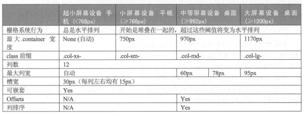

# Bootstrap开发环境

  + [Bootstrap开发环境概述](#bootstrap开发环境概述)

  + [调用Bootstrap样式](#调用bootstrap样式)

## Bootstrap开发环境概述

***

  + [Bootstrap官网](http://getbootstrap.com)

  + [jQuery官网](http://jquery.com)

  + Bootstrap的JavaScript效果都是基于jQuery的，因此需要引入jQuery。

  + src/base.html

## 调用Bootstrap样式

***

  + 如果不使用Bootstrap或者其他类似的框架

    - 第一步肯定是构思设计表格的样式，宽度、高度、行高、对齐方式、边框等很多地方需要考虑，并且一开始的设想与实际效果并不符合，还需要后面不断地调试。

    - 第二步需要编写相应的HTML/CSS代码，边写，边调试，还要边思考如何给id或者class命名，最后可能还需要上司或者同事进行审核。

  + 如果使用Bootstrap：只需要引入Bootstrap，然后在标签内引入class，就可以获得一个设计好的样式。

    - Example: src/load_table_css.html and src/load_navbar.html

  + Bootstrap3的响应式布局区间

    - 
