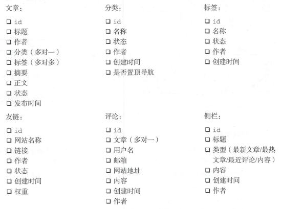
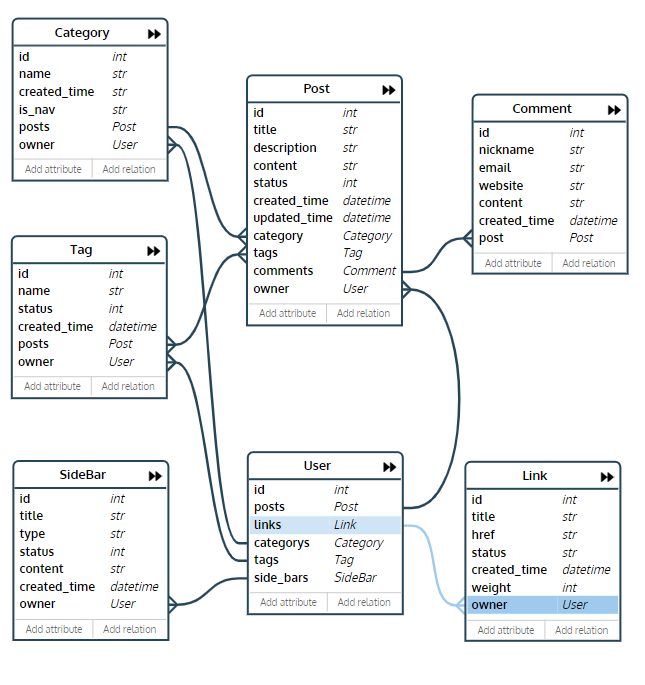
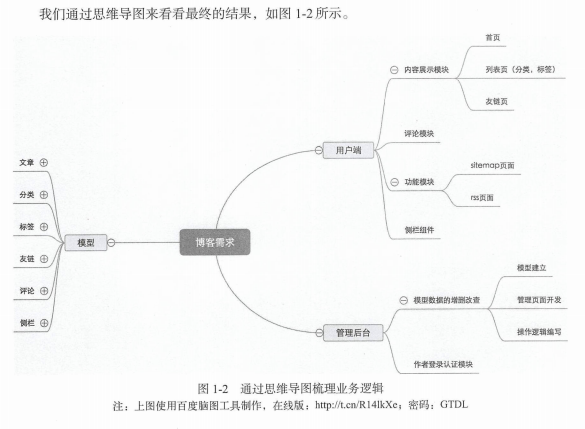

# 需求

  + 软件工程

    - 需求分析、软件设计和软件测试等。

  + Example：博客开发

  + [书籍相关的Github](https://github.com/the5fire/django-practice-book)

  + [需求文档](#需求文档)

  + [需求评审、分析](#需求评审分析)

  + [功能分析](#功能分析)

  + [模块划分](#模块划分)

## 需求文档

***

  + 需求文档是产品经理跟开发人员交流的必不可少的东西，很多东西如果不落实到文档上，出了问题很难追溯。

  + 介绍

    - 博客（英语：Blog，为WebLog的混成词），意指log on the web，即在网络上记录，是一种由个人管理的网站或在线日记，可以张贴新的文章、图片或视频，用来记录、抒发情感或分享信息。博客上的文章通常根据张贴时间，以倒叙方式由新到旧排序。

  + 需求描述

    - 博客系统分为两部分：读者访问部分（用户端）和作者创作部分（作者端）。

    - 用户端需求：

      - 要能够通过搜索引擎搜索到博客内容，进而来到博客

      - 可在博客中进行关键词搜索，然后展示出文章列表

      - 能够根据某个分类查看所有关于这一分类的文章

      - 访问首页时，需要能看到由新到旧的文章列表，以便于查看最新的文章

      - 要能够通过RSS阅读器订阅博主的文章

      - 要能够对某一篇文章进行评论

      - 能够配置友链，方便与网友进行链接

    - 作者端需求：

      - 博客后台需要登录方可进入

      - 能够创建分类和标签

      - 能够以 Markdown 格式编写文章

      - 能够上传文章配图，要有版权声明

      - 能够配置导航，以便引导读者

      - 作者更新后，订阅读者能够收到通知

## 需求评审/分析

***

  + 对于有经验的产品经理来说，在做任何需求的时候，都会计划得足够细致，落实到一个功能点。更好的情况是能够出原型稿，之后可以通过原型来对每个功能点进行逐一核对。

  + 对技术来说，评审的目的有如下三个：

    - 明确所有的需求点，避免出现理解上的歧义

    - 确认技术可行性，避免延期或者后面再修改需求

    - 确认工期，是否需要分期开发

  + 博客评审（逐条分析）

    - 用户端部分：

      - 要能够通过搜索引擎搜索到博客内容，进而来到博客。从技术上来说，这个属于SEO部分，只需要提供sitemap（网站地图）到搜索引擎即可。同时，页面需要对爬虫友好。需要跟产品经理明确的事情是，技术上无法保证一定能够通过搜索引擎搜索到博客，这最终取决于搜索引擎。

      - 可在博客中进行关键词搜索，然后展示出文章列表。需要明确搜索哪些字段,比如标题、标签和分类等。如果需要全文搜索，就要考虑数据量的问题。如果数据量大，就不能直接使用MySQL的LIKE语句，需要增加全文搜索相关的技术栈，比如引入Whoosh、solr或者Elasticsearch这样的搜索引擎。

      - 能够根据某个分类查看所有关于这一分类的文章。对于分类，要明确的是有没有子分类这样的需求，如果有子分类，那么子分类的文章要不要在父分类下展示,以及子分类的层级有没有限制。

      - 访问首页时，需要能看到由新到旧的文章列表，以便于查看最新的文章。首页排序从新到旧没问题，是否有特例，比如某些文章必须置顶。另外，是通过分页的方式展示列表，还是页面可以不断下拉加载的方式。每个页面/每次加载多少条数据。

      - 要能够通过RSS阅读器订阅博主的文章需要提供RSS格式数据的页面。

      - 要能够对某一篇文章进行评论。是否需要前台(用户端)查看所有评论的页面。

      - 能够配置友链,方便与网友进行链接。友链在前台如何展示,是单独的页面还是一个列表页。

    - 作者端部分：

      - 博客后台需要登录方可进入。是否有多用户登录的需求？如果有，那么用户之间的权限如何划分？

      - 能够创建分类和标签。跟上面的问题一样，是否有多级分类和标签的情况，如果有，需要明确父类分类或者标签是否包含子级所关联的内容。

      - 能够以Markdown格式编写文章。作者编写文章时，有哪些是必填的，在网页上编写是否需要实时保存。

      - 能够上传文章配图，要有版权声明。版权声明具体表现为什么？

      - 能够配置导航，以便引导读者。导航是否是指分类？是否包含标签？需要产品经理给出明确的需求。

      - 作者更新后，订阅读者能够收到通知。在博客的整个需求中，并没有需要读者登录的账号系统，无法对读者进行实时通知。但是可以考虑增加邮件订阅功能，通过邮件的方式通知读者。此时需要明确邮件的内容格式，以及作者是否需要控制发送邮件的开关。

## 功能分析

***

  + 我们对需求进行评审，经过细节的沟通之后，产品经理对需求进行了修改和明确。

  + 功能分析：

    - 用户端需求：

      - 网站需要对SEO友好，具体可参考搜索引擎站长白皮书。另外，需要给搜索引擎提供XML格式的sitemap文件。

      - 博客需要提供搜索功能，搜索范围限定在标题、分类和标签上。博客每天的增量数据为10篇文章。

      - 能够根据某个分类查看所有关于这一分类的文章，分类没有层级的关系，只有一级分类。一篇文章只能属于一个分类。

      - 访问首页时，需要能看到由新到旧的文章列表，以便于查看最新的文章。作者可以设置置顶某篇文章，也可以同时置顶多篇文章。多篇文章置顶时，排序规则为从新到旧。

      - 列表分页需求。针对首页、频道页和标签页，都需要提供分页需求，每页展示10篇文章。列表页展示文章时，需要展示摘要，默认为文章的前140个字。

      - 需要能够通过RSS阅读器订阅博主的文章，具体可参考RSS规范。

      - 要能够对某一篇文章进行评论。评论不需要支持盖楼的模式,只需要在文章页面展示评论。在页面侧边栏,也需要能展示最新评论。

      - 能够配置友链，方便与网友进行链接。这在一个页面中展示即可，不需要分类。但是需要能够指定某个友链的权重，权重高者在前面展示。

    - 作者端需求：

      - 博客后台需要登录方可进入。目前没有多用户需求，以后可能会有，要考虑可扩展。

      - 能够创建分类和标签，一篇文章只能属于一个分类，但是可以属于多个标签。标签和分类都没有层级关系。

      - 作者在后台需要设置文章标题、摘要(如果为空，则展示文章前140个字)、正文、分类和标签。不需要实时保存。文章格式默认为Markdown。开发周期够的话，增加可视化编辑器。

      - 增加文章配图时，图片需要增加水印，其内容为网站网址。

      - 导航只是分类，默认展示在顶部。同时每篇文章都需要有浏览路径，以告知读者目前所处位置。浏览路径的组成为：首页>文章所属分类>正文。对于导航的顺序,作者可以设置权重,权重高者在前。顶部最多展示6个分类,多余的分类展示到底部。

      - 作者更新后,读者能够收到通知(暂时不开发)。、

## 模块划分

***

  + 实体及关系

    - 

  + PonyORM

    - 使用editor.ponyorm.com提供的在线工具画出对象实体模型

    - 

  + 思维导图

    - 
