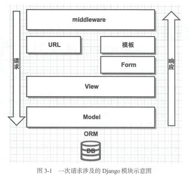

# Django小试牛刀

  + [简介](#简介)

  + [学员管理系统的后台开发](#学员管理系统的后台开发)

  + [学员管理系统的前台开发](#学员管理系统的前台开发)

  + [学员管理系统的进阶部分](#学员管理系统的进阶部分) 

## 简介

***

  + Django是基于MVC（Modle-View-Controller）模式的框架。

  + 

## 学员管理系统的后台开发

***

  + django-admin startproject project_name

  + python3 manage.py startapp app_name

  + write app_name/models.py

  + write app_name/admin.py

  + python3 manage.py makemigrations

  + python3 manage.py migrate

  + python3 manage.py createsuperuser

## 学员管理系统的前台开发

***

  + write app_name/views.py

  + write app_name/templates/index.html

  + write project_name/urls.py

  + write app_name/forms.py

  + write app_name/models.py

## 学员管理系统的进阶部分

***

  + class-based view

    - write app_name/views.py class IndexView

  + middleware

    - write app_name/middlewares.py 

  + TestCase

    - 单元测试是实际开发中很重要但经常被忽视的部分。其原因主要是编写Web功能的测试所耗费的时间可能会高于你开发此功能的时间。因此，对于需要快速开发、上线的业务来说，项目中关于单元测试的部分很少。但是对于需要长期维护的项目，还需要考虑增加单元测试。只是第一次编写时会比较耗费时间，一旦基础结构完成，后续跟着功能的增加来增加单元测试并不会耗费多少时间,但收益却是十分明显的。

    - write app_name/tests.py

    - python3 manage.py test
