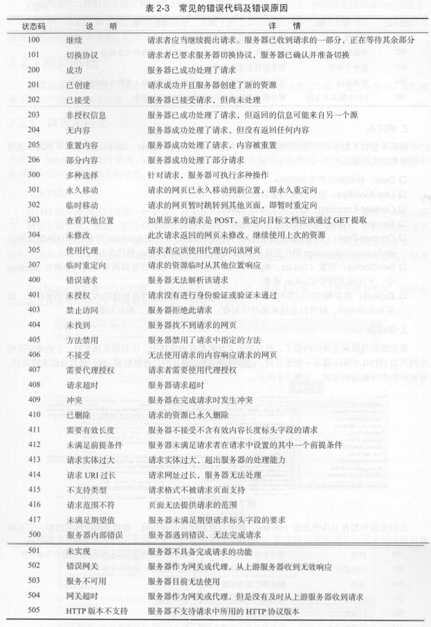
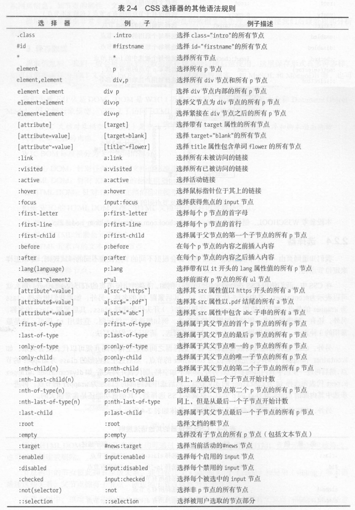

# 爬虫基础

  + [HTTP基本原理](#http基本原理)

  + [网页的组成](#网页的组成)

  + [爬虫基础](#爬虫基础)

  + [会话和Cookies](#会话和cookies)

  + [代理的基本原理](#代理的基本原理)

## HTTP基本原理

***

  + URI

    - URI（Uniform Resource Identifier），即统一资源标志符。包含URL和URN。

    - URL（Universal Resource Locator），即统一资源定位符。

    - URN（Universal Resource Name），即统一资源名称。

  + 超文本（hypertext）：是用超链接的方法，将各种不同空间的文字信息组织在一起的网状文本。超文本更是一种用户界面范式，用以显示文本及与文本之间相关的内容。

  + HTTP

    - HTTP（Hyper Text Transfer Protocol），即超文本传输协议。HTTP协议是用于从网络传输超文本数据到本地浏览器的传送协议，它能保证高效而准确地传送超文本文档。

    - HTTPS（Hyper Text Transfer Protocol over Secure Socket Layer），是以安全为目的的HTTP通道，即HTTP下加入SSL层（加密），简称为HTTPS。

    - 数字证书是互联网通讯中标志通讯各方身份信息的一串数字，提供了一种在互联网上验证通信实体身份的方式。

    - CA即证书授权中心，它是负责管理和签发证书的第三方机构，作用是检查证书持有者身份的合法性，并签发证书，以防证书被伪造或篡改。CA证书就是CA颁发的证书。

  + HTTP请求过程

    - 客户端向网站所在的服务器发送请求，网站服务器接收到请求后进行处理和解析，然后返回对应的响应，接着传回给客户端。响应里包含了页面的源代码等内容，客户端再对其进行解析，便将内容呈现了出来。

  + 请求（Request）

    - 请求方法（Request Method）

      - 常见的请求方法有两种Get和Post。

      - GET请求中的参数包含在URL里面，数据可以在URL中看到，而POST请求的URL不会包含这些数据，数据都是通过表单形式传输的，会包含在请求体中。GET请求提交的数据最多只有1024字节，而POST方式没有限制。

| Method | Description |
| ------ | ----------- |
| GET | 请求页面，并返回页面内容 |
| HEAD | 类似于GET请求，只不过返回的响应中没有具体的内容，用于获取报头 |
| POST | 大多用于提交表单或上传文件，数据包含在请求体中 |
| PUT | 从客户端向服务器传送的数据取代指定文档中的内容 |
| DELETE | 请求服务器删除指定的页面 |
| CONNECT | 把服务器当作跳板，让服务器代替客户端访问其他网页 |
| OPTIONS | 允许客户端查看服务器的性能 |
| TRACE | 回显服务器收到的请求，主要用于测试或诊断 |

    - 请求的网址（Request URL）：即统一资源定位符URL，它可以唯一确定我们想请求的资源。

    - 请求头（Request Headers）：用来说明服务器要使用的附加信息。

| Information | Description |
| ----------- | ----------- |
| Accept | 请求报头域，用来指定客户端可接受哪些类型的信息 |
| Accept-Language | 指定客户端可接受的语言类型 |
| Accept-Encoding | 指定客户端可接受的内容编码（压缩格式） |
| Host | 用来指定请求资源的主机IP和端口号 |
| Cookie | 维持当前访问会话 |
| Referer | 标识这个请求是从哪个页面发送过来的 |
| User-Agent | 可以使服务器识别客户使用的操作系统及版本、浏览器及版本等信息 |
| Content-Type | 用来表示具体请求中的媒体类型信息 |

    - 请求体（Request Body）

      - 请求体一般承载的内容是POST请求中的表单数据，而对于GET请求，请求体则为空。

      - Content-Type和POST提交数据方式的关系

| Content-Type | Description |
| ------------ | ----------- |
| application/x-www-form-urlencoded | 表单数据 |
| multipart/form-data | 表单文件上传 |
| applicatoin/json | 序列化JSON数据 |
| text/xml | XML数据 |

  + 响应（Response）

    - 响应状态码（Response Status Code）：表示服务器的响应状态。如200代表服务器正常响应，404代表页面未找到，500代表服务器内部发生错误。

      - 

    - 响应头（Response Headers）：包含了服务器对请求的应答信息。

| Information | Description |
| ----------- | ----------- |
| Date | 标识响应产生的时间 |
| Last-Modified | 指定资源的最后修改时间 |
| Content-Encoding | 指定相应内容的编码 |
| Server | 包含服务器的信息，比如名称、版本号等 |
| Content-Type | 文档类型，指定返回的数据类型是什么 |
| Set-Cookie | 设置Cookies |
| Expires | 指定响应的过期时间 |

    - 响应体（Response Body）

      - 响应的正文数据都在响应体中，比如请求网页时，它的响应体就是网页的HTML代码；请求一张图片时，它的响应体就是图片的二进制数据。

      - 做爬虫请求网页后，要解析的内容就是响应体。通过响应体得到网页的源代码、JSON数据等。

## 网页的组成

***

  + 如果把网页比作一个人的话，HTML相当于骨架，JavaScript相当于肌肉，CSS相当于皮肤，三者结合起来才能形成一个完善的网页。

  + 在HTML中，所有标签定义的内容都是节点，它们构成了一个HTMl DOM（Document Object Model）树。

    - 整个文档是一个文档节点

    - 每个HTML元素是元素节点

    - HTML元素内的文本是文本节点

    - 每个HTML属性是属性节点

    - 注释是注释节点

  + 

## 爬虫基础

***

  + 爬虫：获取网页并提取和保存信息的自动化程序。

  + 获取网页：构造一个请求并发送给服务器，然后接受到响应并将其解析出来。

  + 提取信息：分析网页源代码，从中提取我们想要的数据。

  + 保存数据：提取信息后，将提取到的数据保存到某处以便后续使用。

## 会话和Cookies

***

  + HTTP的无状态：HTTP协议对事务处理是没有记忆功能的，也就是说服务器不知道客户端是什么状态。

  + 这时两个用于保持HTTP连接状态的技术就出现了，它们分别是会话（Session）和Cookies。会话在服务端，也就是网站的服务器，用来保存用户的会话信息；Cookies在客户端，也可以理解为浏览器端，有了Cookies，浏览器在下次访问网页时会自动附带上它发送给服务器，服务器通过识别Cookies并鉴定出是哪个用户，然后再判断用户是否是登陆状态，然后返回对应的响应。

  + Cookies和会话需要配合，一个处于客户端，一个处于服务器，两者共同协作，就实现了登录会话控制。

  + 会话Cookie和持久Cookie：会话Cookie就是把Cookie放在浏览器内存里，浏览器再关闭之后该Cookie即失效；持久Cookie则会保存到客户端的硬盘中，下次还可以继续使用，用于长久保持用户登陆状态。严格来说，没有会话Cookie和持久Cookie之分，只是由Cookie的Max Age或Expires字段决定了过期时间。

  + 当我们关闭浏览器时，浏览器不会主动在关闭之前通知服务器它将要关闭，所以服务器根本不会有机会知道浏览器已经关闭。由于关闭浏览器不会导致会话被删除，这就需要服务器为会话设置一个失效时间，当距离客户端上一次使用会话的时间超过这个失效时间时，服务器就可以认为客户端已经停止了活动。

## 代理的基本原理

***

  + 代理实际上指的就是代理服务器，英文名Proxy Server，它的功能是代理网络用户去取得网络信息。

  + 代理过程中，Web服务器识别出的真实IP就不再是本机的IP，实现了IP伪装。

  + 对于爬虫而言，由于爬虫爬取速度过快，在爬取过程中可能遇到同一个IP访问过于频繁的问题，此时网站就会让我们输入验证码登录或者直接封锁IP，这样会给爬取带来极大的不便。使用代理隐藏真实的IP，让服务器误以为是代理服务器在请求自己。这样在爬取过程中通过不断更换代理，就不会被封锁，可以达到很好的爬取效果。
